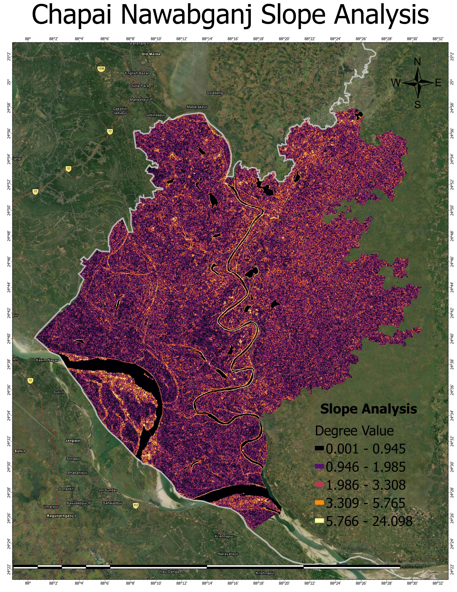
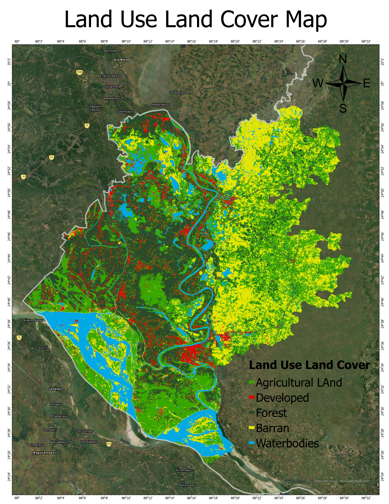

# Managed-Aquifer-Recharge-MAR-Chapai-Nawabganj-Bangladesh
An ArcGIS Pro suitability model for Managed Aquifer Recharge (MAR) in Chapai Nawabganj. Integrates soil texture, slope, LULC, rainfall, and drainage layers using MCDA-AHP to map optimal infiltration zones, addressing regional groundwater depletion with data-driven water resource engineering.
# Managed Aquifer Recharge (MAR) Site Suitability Mapping: Chapai Nawabganj, Bangladesh

A data-driven spatial project utilizing **ArcGIS Pro** and Multi-Criteria Decision Analysis (MCDA) to identify optimal zones for Managed Aquifer Recharge (MAR). This study targets the drought-prone Barind Tract conditions of Chapai Nawabganj to provide data-driven solutions for artificial groundwater table replenishment.

---

## MCDA Criteria & Weighting Distribution
To remove subjectivity from the spatial overlay, an Analytical Hierarchy Process (AHP) pair-wise comparison matrix was established to balance hydrogeological inputs.

### Spatial Factor Influence Breakdown
The chart below visualizes the prioritized weight distribution derived from our multi-criteria decision comparison matrix:

| Spatial Variable | Weight Allocation | Infiltration Role | Engineering Rationale |
| :--- | :---: | :--- | :--- |
| **Rainfall Depth** | **25%** | Volumetric Input Boundary | Establishes the availability of seasonal surface water for recharge. |
| **Soil Texture** | **20%** | Hydraulic Conductivity ($K$) | Controls the physical rate of downward percolation into the aquifer matrix. |
| **Slope Geometry** | **20%** | Surface Retention Time | Low slopes (0.001°–0.945°) maximize retention time; steep zones favor runoff. |
| **Land Use / Cover** | **15%** | Imperviousness & Roughness | Differentiates recharge-friendly agricultural/barren land from urban concrete. |
| **Drainage Density** | **10%** | Network Routing Profile | Highlights areas with localized drainage limitations suitable for detention basins. |
| **River Proximity** | **10%** | Surface Water Access | Measures spatial distance to natural supply channels for water diversion. |

---

## 📈 Reclassification Matrix (Vulnerability to Recharge Value)
The raster reclassification table below maps how input data classes translate step-wise into localized recharge suitability scores (Scaled from 1 = Very Low to 5 = Very High):

| Suitability Class | Topographical Profiles | Land Cover Type (LULC) | Hydrological Exposure | Soil/Infiltration Traits |
| :---: | :--- | :--- | :--- | :--- |
| **1 (Very Low)** | Steep Gradients (>5.76°) | Developed / Built-up Areas | Low Precipitation, Far from Rivers | Heavy Clays (Low Permeability) |
| **2 (Low)** | Moderate Slopes (3.30°–5.76°) | Forest Canopies | Low Flow Accumulation Zones | Silty Clays |
| **3 (Moderate)** | Rolling Terrain (1.98°–3.30°) | Dense Urban Buffers | Average Cumulative Rainfall | Loamy Soils / Standard Silt |
| **4 (High)** | Gentle Slopes (0.94°–1.98°) | Barren / Exposed Land | High Localized Precipitation | Sandy Loams |
| **5 (Very High)**| Flat Basin Sinks (<0.94°) | Agricultural / Water Bodies | Immediate Proximity to Rivers | Coarse Sands (High $K$) |

---

## ⚙️ Core Factors & Spatial Input Graphics

### 1. MAR Suitability Map
The final integrated suitability overlay identifying prime targets for engineered recharge structures.

### 2. Slope Analysis
Derived from high-resolution DEM data to map surface runoff velocities. Flat zones identify areas where water naturally pools and infiltrates.

### 3. Land Use / Land Cover (LULC) Mapping
Supervised classification tracking how natural and anthropogenic landscapes interact with regional water infrastructure.

---

Key Insight:
The final suitability model reveals a good geographic split. The southern alluvial plains and low-gradient agricultural zones show "High" to "Very High" suitability due to highly permeable soil textures, proximity to the Ganges/Padma river networks, and flat slope conditions (<0.94°). On the other hand, the eastern zones show high constraint scores where impervious built-up development restricts downward aquifer percolation.

---

## Geoprocessing & Spatial Toolsets Used
* **Surface Analyst Engine:** `Slope` generation from DEM terrains to calculate infiltration hold-times.
* **Image Classification:** Supervised classification workflow for multi-band Landsat 8 datasets.
* **Overlay Engine:** `Reclassify` and `Weighted Overlay` (or `Weighted Sum`) to execute the multi-criteria suitability matrix.

---

## Source 
* **Digital Elevation Model & Landsat 8 Imagery:** [USGS EarthExplorer](https://earthexplorer.usgs.gov/)
* **Spatio-Temporal Rainfall Data:** [CHIRPS / Climate Hazards Center]((https://www.chc.ucsb.edu/data/chirps))
